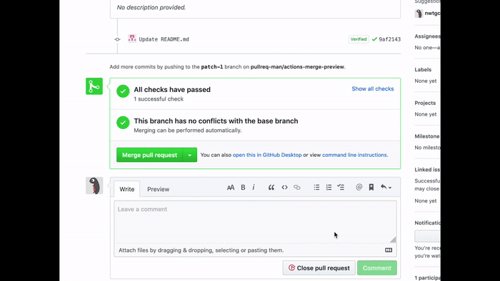

# actions-merge-preview
GitHub Actions for pull-request merge preview

  
(Frames between the request comment and the bot comment are trimmed.)

## Usage

You can use `.github/workflows/merge-preview.yml` as follows. The action is triggered by `@bee-bot merge preview` comments from only owner and collaborators.

```yaml
# .github/workflows/merge-preview.yml
name: "Merge preview"

on:
  issue_comment:
    types: [created]

jobs:
  preview:
    runs-on: ubuntu-18.04
    steps:
    - uses: actions/checkout@v2
    - uses: nwtgck/actions-merge-preview@develop
      with:
        github-token: ${{ secrets.GITHUB_TOKEN }}
```

NOTE:  
Currently, `@bee-bot merge preview` triggers the action, but when you have suggestions of other better comment format, please make an issue.
